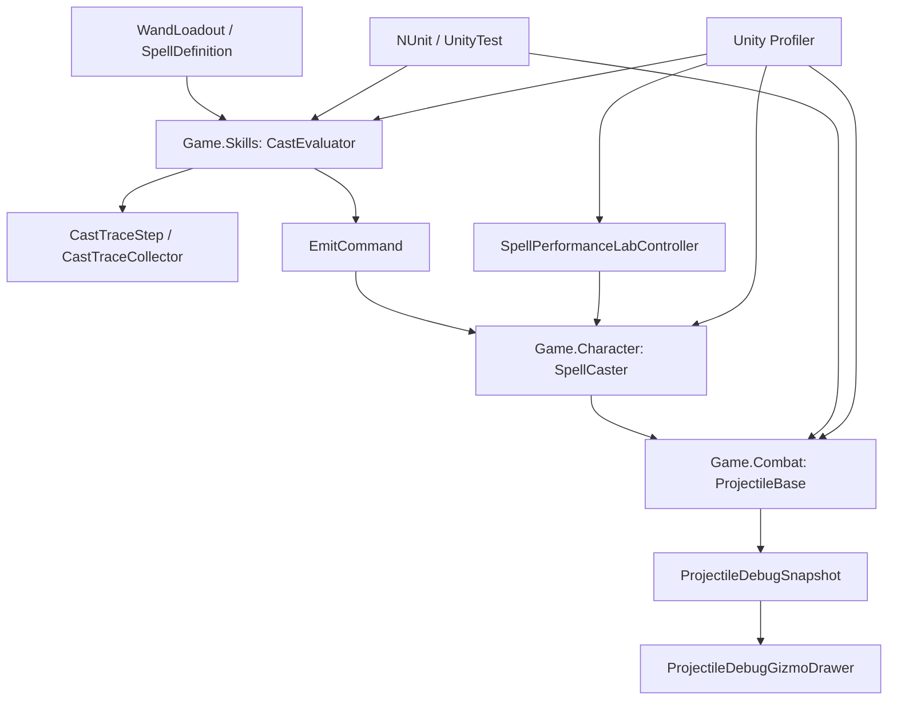
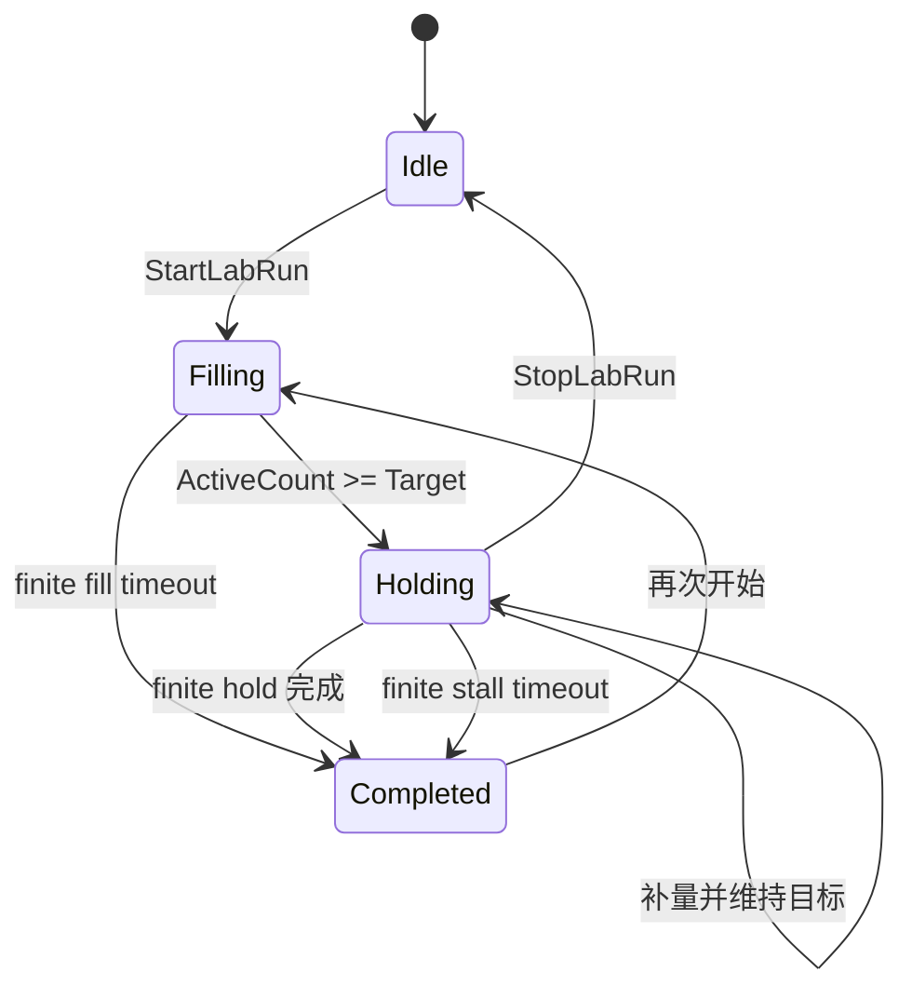

# P0 可持续开发基线：完整设计解析

> 创建时间：2026-07-11 14:24  
> 面向读者：刚开始接触游戏客户端测试、调试工具与性能分析的开发者  
> 对应计划：`docs/superpowers/plans/2026-07-10-P0可持续开发基线.md`

---

## 一、先理解 P0 到底做了什么

P0 不是一个玩家能直接看到的新法术，也不是一次普通的性能优化。它建立的是一套“继续开发复杂法术系统所需的工程基础设施”。

在 P0 之前，某个复杂法术不符合预期时，我们通常只能观察最终结果：火球有没有生成、方向是否正确、是否命中敌人。可是法术编程系统内部经历了很多中间状态：抽取预算如何变化、修正状态如何累积、Mana 在哪一步不足、trigger 捕获了哪段 payload、投射物最终收到哪些运动参数。只看最终画面，很难判断错误到底发生在哪一层。

P0 把这个黑盒拆成了五种可以观察、验证和复现的证据：

1. `Cast Trace`：记录法术解释器每一步读了什么、改了什么、产出了什么。
2. `EditMode / UnityTest`：用自动化断言证明纯逻辑与 Unity 生命周期行为没有退化。
3. `ProjectileDebugSnapshot + Gizmos`：把投射物速度、重力、追踪、轨道和反射信息画在 Scene View 中。
4. `ProfilerMarker`：把法术求值、实例化、运动和压力填充标记成可在 Profiler 中定位的区间。
5. `SpellPerformanceLab`：用统一场景、统一施法入口和阶梯目标，重复制造 1、10、50、100、200 个投射物的压力。

所以 P0 的核心不是“测试更多”，而是建立下面这个闭环：

```text
提出假设
  -> 用测试验证纯逻辑
  -> 用 Trace 检查解释过程
  -> 用 Gizmos 检查空间状态
  -> 用 Profiler 检查运行成本
  -> 用独立 Lab 稳定复现
  -> 修复后重新回归
```

对一个不断增加法术组合的系统来说，这个闭环比单个法术功能更重要。没有它，法术越多，组合数量越接近指数增长，Debug 成本也会快速失控。

---

## 二、基础知识和原理

### 2.1 测试不是“证明程序永远正确”

自动化测试只能证明：在明确给出的输入、环境和断言下，当前代码产生了预期结果。

例如：

```text
输入：伤害修正 x1.5 + 火球基础伤害 10
执行：CastEvaluator.EvaluateWithTrace(...)
期望：最终 EmitCommand.Damage == 15
```

这个测试能防止以后改动解释器时把伤害修正弄坏，但它不能证明所有法术组合都正确，也不能证明 Prefab、Collider、VFX 和 Animator 在场景中配置正确。

因此本项目需要三种互补验证：

| 验证类型 | 主要回答的问题 | 代表工具 |
|---|---|---|
| 纯逻辑测试 | 算法结果是否正确、边界条件是否稳定 | NUnit `[Test]` |
| Unity 生命周期/物理测试 | `Awake`、`OnEnable`、物理帧和销毁流程是否正确 | `[UnityTest]`、`EnterPlayMode`、`WaitForFixedUpdate` |
| 人工场景验证 | Prefab、Inspector、画面、手感和组合玩法是否正确 | Play Mode、Scene View、Profiler |

这就是测试金字塔思想在本项目中的简化版本：底部是数量多、速度快、稳定的纯逻辑测试；中间是更慢的 Unity 集成测试；顶部是少量但不可替代的人工玩法验证。

### 2.2 Arrange、Act、Assert

一个容易阅读的测试通常分为三个阶段：

- `Arrange`：准备法术、组件、GameObject 和输入数据。
- `Act`：调用一次被测行为。
- `Assert`：比较实际值与期望值。

以 `Snapshot_Configuration_ReportsPositionVelocityGravityHomingAndOrbit` 为例：

```text
Arrange：创建测试投射物，配置 Homing、Orbit、Velocity、Gravity
Act：调用 GetDebugSnapshot()
Assert：检查快照中的位置、速度和开关是否与配置一致
```

这种结构的意义不只是格式整齐。它让测试失败时很容易分辨：是测试数据准备错了、执行路径错了，还是输出断言错了。

### 2.3 Test Double：为什么测试里要有测试投射物子类

`ProjectileDebugTestProjectile : ProjectileBase` 是一个很轻量的 `Test Double`。它不是正式游戏内容，而是为了让测试能够访问 `ProjectileBase` 的 protected 字段和配置路径。

常见 Test Double 包括：

- `Stub`：返回预设数据。
- `Fake`：功能简化但可实际运行，例如内存数据库。
- `Mock`：验证某个调用是否发生。
- 测试子类：暴露受保护的测试入口。

本项目没有引入复杂 Mock 框架，而是使用测试子类和真实 Unity 组件。这更贴合当前项目规模，也减少了测试与真实行为之间的偏差。

### 2.4 Deterministic：为什么测试要尽量确定性

如果同一个测试有时成功、有时失败，它就是 `Flaky Test`。这种测试会迅速失去信任，因为开发者不知道失败代表真实 Bug，还是时序波动。

纯逻辑 `CastEvaluator` 很适合确定性测试，因为相同法术序列、相同 `baseDraws`、相同 Mana 和相同 `incomingMods` 必须得到相同 `EmitCommand`。

物理测试更容易波动，所以反弹测试会：

- 创建固定位置和尺寸的墙体；
- 给投射物固定初速度；
- 最多等待若干个 `FixedUpdate`；
- 在检测到反射记录后立刻停止等待。

这里不是在等待“现实时间差不多够了”，而是在等待一个明确的物理条件。

### 2.5 Snapshot：为什么调试层不直接读取一堆 private 字段

`ProjectileDebugSnapshot` 是一个只读值快照。`ProjectileBase` 在某一时刻把调试所需状态复制进去，Gizmo 和测试只读取这个快照。

它解决了三个问题：

1. 封装：Drawer 不需要知道 `ProjectileBase` 内部字段怎么组织。
2. 模块边界：`Game.Combat` 的调试结构不依赖 `Game.Skills`。
3. 稳定性：以后内部实现变化，只要快照契约不变，测试和可视化层不必一起重写。

这里使用 `readonly struct`，因为它表达“这是一份不可修改的值数据”，也避免每次读取都创建堆对象。

### 2.6 Observability：可观测性和普通日志有什么区别

普通日志往往只是：“Cast failed”或者“Projectile spawned”。它告诉你发生了什么，却不一定告诉你为什么。

结构化 `Cast Trace` 记录的是状态变化：

```text
步骤类型
法术索引
DrawBudget Before / After
Mana Before / After
CastModifierState Before / After
EmitCommand 最终快照
Payload 起点、数量和触发类型
```

因此当“三重射击 + 追踪 + 轨道 + 定时触发”失败时，可以逐行追踪：

```text
Multicast 是否先增加 DrawBudget
Modify 是否覆盖 MotionMode
Emit 是否拿到最终 Homing/Orbit 参数
Trigger 是否捕获正确后缀
Mana 是否在正确法术索引处 Fizzle
```

这就是 `Observability`：系统主动提供足够证据，让开发者从外部推断内部发生了什么。

### 2.7 性能基线不是性能结论

`SpellPerformanceLab` 记录的是当前机器、当前 Unity Editor、当前场景、当前资源配置下的相对基线。

它不能直接证明：

- 正式 Release Build 一定有相同 FPS；
- 低配机器也能稳定运行 200 个投射物；
- 未来增加 VFX 后性能不变。

Editor 自身有 Inspector、Console、Scene View、脚本调试等额外成本。因此 P0 的数据更适合回答：

```text
加入新功能后，相比昨天是否明显退化？
10 -> 50 -> 100 -> 200 时，成本主要增长在哪个系统？
GC Alloc 是否从 0 变成了持续分配？
Physics 还是 Rendering 先成为瓶颈？
```

这叫 `Baseline`，不是 `Certification`。

---

## 三、业界常见实现方案与取舍

### 3.1 方案一：到处添加 Debug.Log

优点是开发快，适合一次性定位简单问题。缺点是日志分散、字段不统一、组合复杂后难以关联，并且字符串格式化和 Console 输出会污染性能数据。

本项目保留 `GameLog` 作为低成本入口，但没有把 P0 设计成“多打日志”。`GameLog` 受 `[Conditional("DEVELOPMENT_BUILD")]` 和 `[Conditional("UNITY_EDITOR")]` 控制，Release 中调用点可以被编译器移除。

### 3.2 方案二：只用断点和 Debugger

断点适合观察某一帧的局部状态，但对物理运动、协程、延迟 trigger、几十个投射物并发并不友好。暂停游戏还会改变时序，难以分析性能。

P0 没有排斥 Debugger，而是让 Trace 和 Snapshot 先把问题范围缩小，再用断点深入具体函数。

### 3.3 方案三：只依赖 Unity Profiler 和 Deep Profile

Profiler 能回答“时间花在哪里”，却不能自动回答“法术解释结果为什么错了”。`Deep Profile` 会插入大量采样，显著改变运行成本，尤其不适合作为常规基线。

最终方案使用少量手动 `ProfilerMarker` 标记关键业务区间，记录基线时关闭 `Deep Profile`、Trace 和 Gizmos。

### 3.4 方案四：运行时 Debug Overlay

很多商业项目会制作游戏内调试面板，显示实体数量、行为树状态、技能冷却、网络延迟等。优点是可以在 Development Build 甚至目标设备上使用，缺点是开发成本和 UI 维护成本更高。

P0 第一版选择 Scene View Gizmos，是因为当前主要在 Unity Editor 中开发，空间调试比运行时 UI 更急迫。以后需要真机性能分析时，可以在现有 Snapshot 上增加 Development Build Overlay，而不用侵入投射物逻辑。

### 3.5 方案五：自动化 Performance Test Framework

Unity 有 Performance Testing 相关工具，可以多次采样、计算中位数、比较阈值并接入 CI。它适合稳定项目和长期性能门禁。

当前项目仍在快速变化，Prefab、VFX 和法术类型持续增加，过早设置硬阈值容易产生大量误报。因此 P0 先做可人工控制的 Lab 和 Profiler 基线。等场景与硬件基准稳定后，再把关键 Scenario 自动化，是更合理的演进顺序。

### 3.6 最终选择：分层可观测性 + 分层测试

最终方案不是在上述方案里只选一个，而是让每种工具回答不同问题：

| 层 | 工具 | 负责回答 |
|---|---|---|
| 法术纯逻辑 | `CastTraceStep`、NUnit | 解释器每一步是否正确 |
| Unity 运行桥接 | `SpellCaster` Trace、`ProfilerMarker` | 纯命令如何变成真实对象 |
| 投射物运行状态 | Snapshot、Gizmos、UnityTest | 运动参数和生命周期是否正确 |
| 系统规模 | Performance Lab、Profiler | 并发数量上升后成本如何变化 |
| 最终体验 | 人工 Play Mode | 玩法、画面和组合是否符合设计 |

这个设计的关键取舍是：诊断能力附着在现有架构旁边，不把诊断逻辑变成新的 Gameplay 依赖。

---

## 四、最终使用的技术与 Unity API

### 4.1 NUnit `[Test]`

`[Test]` 来自 NUnit，标记一个同步测试方法。它适合不需要等待帧、不需要真实 Unity 生命周期的逻辑。

例如 `CastTraceTests` 直接创建 `SpellDefinition`，调用 `CastEvaluator.EvaluateWithTrace`，然后用：

- `Assert.AreEqual`：判断值是否相等；浮点数通常传入容差 `1e-4f`。
- `Assert.IsTrue / IsFalse`：判断布尔条件。
- `Assert.AreSame`：判断两个引用是否指向同一个对象，而不是只比较内容。
- `Assert.Throws<T>`：判断调用是否抛出指定异常。

### 4.2 `[UnityTest]` 与 `IEnumerator`

`[UnityTest]` 允许测试方法通过 `yield return` 跨帧执行。它适合：

- 等待 `Awake`、`Start`、`OnEnable`；
- 等待 `Object.Destroy` 在帧尾真正生效；
- 等待物理 `FixedUpdate`；
- 测试协程和时间相关逻辑。

项目中使用的关键 Unity Test Framework 指令：

- `new EnterPlayMode()`：让测试进入 Play Mode，使 Unity 运行真实生命周期。
- `new ExitPlayMode()`：退出 Play Mode，恢复测试环境。
- `yield return null`：等待一帧。
- `new WaitForFixedUpdate()`：等待下一次物理更新。
- `[UnityTearDown]`：每个 UnityTest 后执行清理，避免前一个测试污染后一个测试。

### 4.3 `Object.Destroy` 与 `Object.DestroyImmediate`

- `Object.Destroy(obj)`：延迟到当前帧结束后销毁，是 Play Mode 的正常做法。
- `Object.DestroyImmediate(obj)`：立即销毁，常用于 EditMode 测试和编辑器工具。

如果在 Play Mode 调用 `Destroy` 后立刻断言对象已注销，测试可能失败，因为销毁尚未真正发生。因此测试会 `yield return null` 后再检查 `ActiveCount`。

### 4.4 Unity 生命周期 API

P0 重点涉及：

- `Awake()`：组件加载时初始化 `Rigidbody`、Collider 等引用。
- `OnEnable()`：对象启用时重新注册活动投射物。
- `OnDisable()`：对象禁用时注销。
- `OnDestroy()`：对象销毁时做最终注销。
- `Update()`：Performance Lab 状态机每帧推进。
- `FixedUpdate()`：投射物物理运动与追踪、轨道更新。
- `OnDrawGizmos()`：Unity Editor 请求绘制 Gizmos 时调用。

理解这些回调的触发条件，是这次测试踩坑中最重要的基础知识之一。

### 4.5 `ProfilerMarker`

`Unity.Profiling.ProfilerMarker` 用来给 Profiler 添加自定义采样区间。

项目中使用静态只读 Marker：

```csharp
private static readonly ProfilerMarker s_evaluateMarker =
    new ProfilerMarker("Spell.Evaluate");
```

然后使用：

```csharp
using (s_evaluateMarker.Auto())
{
    // 被测代码
}
```

`Auto()` 返回一个可释放的作用域对象，离开 `using` 时自动结束采样。当前四个关键 Marker 是：

- `Spell.Evaluate`：解释法杖序列。
- `Spell.RuntimeSpawn`：把 `EmitCommand` 变成 GameObject。
- `Projectile.Motion`：投射物每个物理帧的运动逻辑。
- `PerformanceLab.Fill`：实验场景补充投射物的施法循环。

Marker 使用 `static readonly`，避免每帧重新创建标记对象。

### 4.6 Gizmos API

`ProjectileDebugGizmoDrawer` 用到的核心 API：

- `OnDrawGizmos()`：编辑器绘制入口。
- `Camera.current`：当前正在执行绘制的 Camera，不等同于 `Camera.main`。
- `CameraType.SceneView`：只允许 Scene View 绘制，避免打开 Game View Gizmos 时重复显示。
- `Gizmos.color`：设置后续线框颜色，是全局静态状态。
- `Gizmos.matrix`：设置绘制变换矩阵，也是全局静态状态。
- `Gizmos.DrawLine`：画线和箭头。
- `Gizmos.DrawWireSphere`：画追踪范围、轨道中心。
- `Selection.activeTransform`：读取 Unity Editor 当前选择对象，仅在 `UNITY_EDITOR` 下可用。
- `Matrix4x4.identity`：把 Gizmo 绘制重置到世界空间。

因为 `Gizmos.color` 和 `Gizmos.matrix` 是全局状态，脚本使用 `try/finally` 恢复旧值。否则这个 Drawer 可能改变其他组件 Gizmo 的颜色或坐标系。

### 4.7 数学 API 在可视化中的作用

- `Vector3.Cross(a, b)`：计算垂直向量，用于构造箭头两侧。
- `vector.normalized`：只保留方向。
- `sqrMagnitude`：不做开平方的长度平方，用于快速判断是否接近零。
- `Mathf.Sin / Mathf.Cos`：按角度在轨道平面上采样圆周点。
- `Mathf.PI * 2`：一整圈弧度。
- `Mathf.Min`：限制箭头头部长度，避免短向量画出夸张箭头。

这些 API 同时也是图形学学习可以落地的地方：坐标系、基向量、叉积、参数圆、世界空间变换都真实出现在调试工具中。

### 4.8 Inspector 与开发工具 API

`SpellPerformanceLabController` 使用：

- `[SerializeField]`：private 字段仍可在 Inspector 中配置和序列化。
- `[Header("...")]`：给 Inspector 分组。
- `[Min(x)]`：限制 Inspector 数值最小值。
- `[Range(a, b)]`：显示滑条并限制范围。
- `[ContextMenu("Start Lab Run")]`：在组件右键菜单中暴露命令，无需制作额外 EditorWindow。
- `Application.isPlaying`：防止在非 Play Mode 误启动实验。
- `Time.unscaledDeltaTime`：使用不受 `Time.timeScale` 影响的帧间隔，避免暂停或时间缩放改变实验计时。

### 4.9 编译条件

诊断代码使用：

```csharp
#if UNITY_EDITOR || DEVELOPMENT_BUILD
#endif
```

这表示 Detailed Trace 等诊断逻辑只在 Unity Editor 或 Development Build 中参与编译。正式 Release 不需要携带详细诊断开销。

Gizmo Drawer 更严格，只在 `UNITY_EDITOR` 下编译，因为 `UnityEditor.Selection` 等 API 不能进入 Player Build。

---

## 五、总体架构设计

### 5.1 P0 在现有架构中的位置



依赖方向没有被打乱：

- `Game.Skills` 仍只负责纯数据和解释器，不实例化投射物。
- `Game.Combat` 只暴露投射物自身事实，不知道什么是法术种类。
- `Game.Character` 本来就依赖 Skills 和 Combat，因此由它负责 Runtime Trace 和 Lab 驱动最合适。
- Scene View Drawer 放在 Combat，是因为它只读取 Projectile Snapshot。

### 5.2 为什么 Trace 数据放在 Game.Skills

Trace 描述的是“解释器执行语义”，例如 `ModifyApplied`、`MulticastApplied`、`DrawBudgetBlocked`。这些概念属于法术语言本身，因此应与 `CastEvaluator` 同程序集。

如果把 Trace 写进 `SpellCaster`，我们只能看到最终 `EmitCommand`，看不到解释器内部每一步状态变化，还会迫使测试依赖 MonoBehaviour。

### 5.3 为什么 Evaluate 和 EvaluateWithTrace 共用 EvaluateCore

这是 P0 最关键的架构选择之一。

错误方案是复制一份解释器：一份正常求值，一份带 Trace 求值。两份代码未来很容易产生语义漂移，例如正常模式支持新法术，但 Trace 模式忘记更新。

现在的结构是：

```text
Evaluate(...)
  -> EvaluateCore(..., trace = null)

EvaluateWithTrace(...)
  -> trace.Clear()
  -> EvaluateCore(..., trace = collector)
```

唯一差别是 `trace` 是否为空。Gameplay 语义始终只有一份实现。

### 5.4 CastTraceStep 为什么保存 Before / After

只保存最终值，很难回答某一步做了什么。保存前后快照后，可以直接观察状态转移：

```text
DamageMul 1.0 -> 1.5
DrawBudget 1 -> 3
Mana 50 -> 45
MotionMode Homing -> Orbit
```

这也是调试状态机、解释器、Buff 系统时很常见的做法：记录 transition，而不是只记录 final state。

### 5.5 CastTraceLevel 的三级策略

- `Off`：常规游戏和性能测试使用，不收集 Trace。
- `Summary`：只记录一次施法的总体结果，例如 Emit 数、Mana 和 Fizzle。
- `Detailed`：记录所有解释步骤和完整修正/发射字段。

这种分级是对可观测性与开销的平衡。Detailed 会产生较多日志和格式化字符串，因此 Performance Lab 会在 Trace 未关闭时警告。

### 5.6 ProjectileBase 活动注册表

`ProjectileBase` 维护静态 `List<ProjectileBase> s_active`：

- `Init` 后注册；
- `OnDisable` / `OnDestroy` 时注销；
- 已初始化对象重新 `OnEnable` 时注册；
- `ActiveCount` 给 Lab 使用；
- `ActiveProjectiles` 给 Drawer 只读遍历。

这个注册表原本还承担同阵营投射物 `Physics.IgnoreCollision` 的配对。P0 没有另建第二套投射物查找系统，而是在现有权威列表上增加只读诊断入口，减少重复状态。

### 5.7 Snapshot 与 Drawer 的边界

`ProjectileBase.GetDebugSnapshot()` 负责“提供事实”，Drawer 负责“决定怎么画”。

例如：

```text
Snapshot：最近碰撞点、法线、反射方向、发生时间
Drawer：0.5 秒内用红色画法线、绿色画反射方向
```

这样未来可以用同一 Snapshot 做：

- Runtime Debug Overlay；
- 远程遥测；
- 录制/回放；
- 自动截图测试；
- 更详细的 EditorWindow。

### 5.8 Performance Lab 为什么调用真实 SpellCaster

压力驱动器没有直接 `Instantiate` 火球，而是调用：

```text
SpellPerformanceLabController
  -> SpellCaster.CastWand
  -> CastEvaluator
  -> EmitCommand
  -> Instantiate
  -> ProjectileBase.Init
```

这保证测到的是正式施法路径，包括 Mana、Multicast、payload 配置、运动修正、音效去重和投射物初始化。如果 Lab 直接生成 Prefab，测到的只是“很多 GameObject”，不能代表法术系统真实成本。

### 5.9 Performance Lab 状态机



关键字段：

- `_currentTarget`：当前目标数量。
- `_peakActive`：本次运行观测到的峰值。
- `_phaseTimer`：Filling 用作填充时间，Holding 用作真正达到目标后的保持时间。
- `_stallTimer`：Holding 掉到目标以下且无法补足时的独立超时计时。
- `_maxCastsPerFrame`：限制每帧最多施法次数，避免一帧瞬间制造全部对象导致巨大尖峰。

只有 `ActiveCount >= target` 时才累计 Hold。否则“维持 5 秒”可能实际上只在第一帧达到目标，后四秒已经大量掉量，却仍被报告成功。

### 5.10 测试程序集与生产程序集

测试代码放在 `Assets/_Project/Tests/Skills` 和 `Assets/_Project/Tests/Combat`，通过独立 asmdef 引用生产程序集。

这形成一个重要方向：

```text
Tests -> Production Code
Production Code -X-> Tests
```

正式游戏代码永远不应该依赖测试程序集。

---

## 六、添加和修改的脚本

### 6.1 新增：Skills 诊断数据

#### `CastTraceStepKind.cs`

定义解释器步骤枚举：开始、跳过空法术、应用修正、应用多重、预算阻断、产出 Emit、捕获 payload、Mana Fizzle、结束。

#### `CastTraceStep.cs`

一个不可变步骤快照，保存索引、法术引用、预算、Mana、修正状态、Emit 和 payload 信息。它是 Trace 的数据协议。

#### `CastTraceCollector.cs`

内部复用 `List<CastTraceStep>`，提供 `Clear`、`Record`、索引访问和容量扩张告警。`ExpandedDuringLastCollection` 用来发现预分配容量不足导致的 List 扩容。

### 6.2 修改：`CastEvaluator.cs`

主要变化：

- 新增 `ProfilerMarker("Spell.Evaluate")`；
- 新增 `EvaluateWithTrace`；
- 抽取唯一的 `EvaluateCore`；
- 在每个语义分支记录结构化步骤；
- 保持原有 payload 严格后缀、draw budget 和 Mana 语义；
- Trace 与非 Trace 输出通过完整 `EmitCommand` 等价测试。

### 6.3 新增：`CastTraceLevel.cs`

定义 `Off / Summary / Detailed`，属于 `Game.Character`，因为它控制的是 `SpellCaster` 的运行时诊断策略，而不是改变法术语言语义。

### 6.4 修改：`SpellCaster.cs`

主要变化：

- Inspector 增加 `_traceLevel`；
- Development 环境持有可复用 `_traceCollector`；
- 每次施法分配 `castId`，payload 递归保留同一 castId 并增加 depth；
- Summary 输出总体结果；
- Detailed 输出每一步完整 modifier 与 emit 参数；
- Mana 预检查失败也能记录 Fizzle 上下文，但不扣 Mana、不生成投射物；
- 新增 `ProfilerMarker("Spell.RuntimeSpawn")`；
- `TraceLevel` 在非 Development 构建中表现为 Off。

这里尤其重要的是：诊断求值不能改变 Gameplay。Mana 不足时的 Detailed Trace 只做纯 `EvaluateWithTrace`，随后清空诊断 `_emits`，绝不能实例化或重复扣费。

### 6.5 新增：`ProjectileDebugSnapshot.cs`

保存：

- Position、Velocity、UseGravity；
- Homing 是否启用、范围、目标位置；
- Orbit 中心和局部基向量；
- 最近反射的碰撞点、法线、方向和时间。

### 6.6 修改：`ProjectileBase.cs`

主要变化：

- 活动列表暴露 `ActiveCount` 和程序集内只读列表；
- `OnEnable`、`OnDisable`、`OnDestroy` 生命周期注册更完整；
- 新增 `ProfilerMarker("Projectile.Motion")`；
- 反弹和护盾反射时记录最近反射数据；
- `Init` 时清理上一轮反射状态，支持对象重新初始化；
- 新增 `GetDebugSnapshot()`。

### 6.7 新增：`ProjectileDebugGizmoDrawer.cs`

遍历活动投射物并按类别绘制：

- 白色：Velocity；
- 黄色：Gravity；
- 青色范围与绿色连线：Homing；
- 蓝色中心、蓝色前向、橙色轨道圆：Orbit；
- 红色法线、绿色反射方向：最近碰撞。

它只在 Scene View 运行，并恢复 Gizmos 全局状态。

### 6.8 新增：`SpellPerformanceLabController.cs`

提供：

- 多 Scenario 配置；
- Standard Ladder：1、10、50、100、200；
- Custom 有限保持；
- Custom 无限维持；
- 每帧施法上限；
- Fill、Hold、Stall 状态与超时；
- PeakActive 和结构化日志；
- `PerformanceLab.Fill` Marker；
- 运行中重复 Start 的保护。

### 6.9 新增和修改测试

#### `CastTraceTests.cs`

验证 Collector 复用、容量扩张、各步骤类型、Mana Fizzle、payload、AfterDelay、incomingMods，以及 Trace/非 Trace 的完整 `EmitCommand` 等价性。

#### `ProjectileDebugSnapshotTests.cs`

验证注册/注销、Disable/Enable 重注册、同队碰撞忽略恢复、Snapshot 字段、重新 Init 清理反射状态、真实物理反弹记录。

#### `ManaComponentTests.cs`

从普通 `[Test]` 调整为进入 Play Mode 的 `[UnityTest]`，因为 `ManaComponent` 的初始值依赖 `Awake`。

#### `StatusControllerTests.cs`

中毒 DoT 测试改为 Unity 生命周期测试，确保 `HealthComponent.Awake` 已初始化生命值后再扣血。

---

## 七、推荐的脚本学习顺序

不要按文件夹字母顺序阅读。建议沿着“数据如何从法杖走到画面”学习：

1. `CastTraceStepKind.cs`：先认识有哪些解释步骤。
2. `CastTraceStep.cs`：理解一步需要保存哪些 Before / After 数据。
3. `CastTraceCollector.cs`：理解如何复用容器并检测扩容。
4. `CastEvaluator.cs`：对照 switch 分支观察每种法术如何记录 Trace。
5. `CastTraceTests.cs`：从测试反推每个语义的输入输出。
6. `CastTraceLevel.cs`：理解诊断等级。
7. `SpellCaster.cs`：理解 castId、depth、Mana 预检查和 Runtime Spawn。
8. `ProjectileDebugSnapshot.cs`：先读数据契约。
9. `ProjectileBase.GetDebugSnapshot` 与生命周期注册：理解事实从哪里来。
10. `ProjectileDebugGizmoDrawer.cs`：理解事实如何转成空间图形。
11. `ProjectileDebugSnapshotTests.cs`：理解生命周期和物理测试。
12. `SpellPerformanceLabController.cs`：最后学习压力状态机，因为它依赖前面所有入口。

阅读时每个脚本都回答三个问题：

```text
它拥有哪类数据？
谁调用它？
它允许依赖谁、不能依赖谁？
```

这比试图一次记住所有字段更容易建立架构认知。

---

## 八、踩坑与 Debug 复盘

### 8.1 在 EditMode `AddComponent` 后直接测试，`Awake` 没按预期执行

最初两个 Mana 测试和中毒 DoT 测试失败。根因不是 Mana 或 DoT 算法错误，而是测试错误地依赖了 Unity 生命周期。

在普通 EditMode `[Test]` 中创建 GameObject、添加组件后，不能想当然地认为它与正常 Play Mode 有完全相同的生命周期。`ManaComponent.CurrentMana` 和 `HealthComponent.CurrentHp` 的初始化依赖 `Awake`，因此读到了未初始化状态。

解决办法是改用 `[UnityTest]`，先 `EnterPlayMode`，再创建组件和执行断言。

经验：测试失败时先问“生产逻辑错了，还是测试环境没有满足生产逻辑的前置条件？”

### 8.2 静态活动列表的生命周期泄漏

只在 `Init` 注册、`OnDestroy` 注销还不够。对象可能被对象池或测试暂时 `SetActive(false)`，此时它不应该继续计入 ActiveCount；重新启用后又应该恢复注册和同阵营碰撞忽略。

最终补齐 `OnEnable / OnDisable / OnDestroy`，并用 UnityTest 验证 Disable -> Enable -> Destroy 的完整链路。

### 8.3 重新 Init 后保留旧反射历史

如果未来投射物进入对象池，同一个对象会多次 `Init`。上一次反弹留下的碰撞法线和时间不能污染新投射物。

解决办法是在 `Init` 重置反射快照，并增加 re-init 测试。这个问题体现了“对象生命周期”和“实例生命周期”并不总是同一回事。

### 8.4 Gizmos 全局状态污染

`Gizmos.color` 和 `Gizmos.matrix` 是静态全局状态。Drawer 中途 return 或抛出异常，都可能让其他 Gizmo 使用错误颜色或矩阵。

解决办法是保存旧值，并在 `finally` 中恢复。

### 8.5 Scene View 和 Game View 都可能请求 Gizmos

只写 `#if UNITY_EDITOR` 不能保证只在 Scene View 绘制。Game View 打开 Gizmos 后也可能执行绘制。

解决办法是检查：

```csharp
Camera.current != null
Camera.current.cameraType == CameraType.SceneView
```

### 8.6 Performance Lab 的 Hold 计时不严谨

早期逻辑中 `_phaseTimer` 每帧增长。即使投射物已经跌破目标，有限模式仍可能在计时结束后报告完成。

最终把 Hold 与 Stall 分开：达到目标才增长 Hold；低于目标先补量，补不回来就增长 Stall；有限模式 Stall 超时后明确结束并警告。

### 8.7 运行中重复 Start 污染实验状态

重新点击 Start 会重置 tier 和 peak，但旧投射物仍存在，导致低档目标瞬间被满足，数据不可比。

最终在 `Filling / Holding` 状态拒绝重复启动，并保留当前 Scenario、Target 和 Peak。

### 8.8 Mana 预检查失败时没有 Trace

`SpellCaster` 为了实现“触发时再检查并扣 Mana”，会先估算本层 Mana。早期 Mana 不足会在进入 Trace 求值前返回，因此最需要诊断的 Fizzle 反而没有记录。

最终方案保持 Gameplay 语义不变：不扣 Mana、不生成投射物；但在 Summary/Detailed 模式下额外产生诊断上下文。Detailed 的求值结果必须清空，不能流入 Spawn。

### 8.9 Trace 与正常求值的等价测试不完整

最初只比较 Damage、Speed 等少数字段。如果 Orbit、payloadMods、SpawnMode 或 AfterDelay 发生漂移，测试仍可能通过。

最终增加完整 `AssertEmitCommandEquivalent` 与 `AssertModifierStateEquivalent`，把所有重要字段逐项比较。

### 8.10 Unity 自动生成 `.meta` 的空白警告

`git diff --check` 曾报告 Unity 自动生成 `.meta` 或用户场景中的 trailing whitespace。`.meta` 的 GUID 关系到资源引用，不应为了格式洁癖手工重写；用户场景的无关改动也不能擅自修改。

最终做法是区分：本任务代码范围必须 clean；Unity/用户已有文件的问题如实记录但不越权修复。

---

## 九、P0 对后续开发的帮助

### 9.1 新增法术时有统一验证入口

以后增加穿透、链式闪电、元素附着、范围场或新 Multicast，可以按固定顺序验证：

```text
先写 CastEvaluator 测试
-> 检查 Detailed Trace
-> 如涉及空间运动，扩展 Snapshot/Gizmos
-> 加入 Performance Lab Scenario
-> 运行完整回归
```

### 9.2 多修正冲突更容易解释

轨道、追踪、重力、弹跳会争夺运动控制权。Detailed Trace 能证明最终 `MotionMode` 和所有参数是什么，Snapshot 能证明运行时实际状态是什么。这样可以区分：

- 解释器优先级错误；
- `EmitCommand` 快照错误；
- `SpellCaster` 配置错误；
- `ProjectileBase` 运动执行错误。

### 9.3 为元素世界和状态反应建立工程模板

未来元素系统也可以沿用同样思路：

- 纯反应规则做 deterministic tests；
- 用只读 snapshot 暴露元素单元状态；
- 用 Scene View Gizmos 显示邻域、温度、流向；
- 用 Lab 构造固定数量的元素单元；
- 用 ProfilerMarker 标记反应求解、传播和渲染。

P0 因此不是只服务法术系统，它实际上是未来沙盒元素系统的工程预演。

### 9.4 为性能预算提供历史参照

当新增法术让 100 个投射物的 Physics 或 GC 明显增长时，可以与 P0 基线比较。没有历史基线，开发者只能凭感觉说“好像变卡了”。

### 9.5 为 CI 和自动化门禁预留道路

当前 Test Runner 仍由开发者手动运行，Performance Lab 也主要人工采样。但纯逻辑测试、稳定 Scenario 和 Marker 已经准备好。以后可以逐步增加：

- Unity BatchMode 自动跑测试；
- CI 保存测试报告；
- Performance Testing Framework 多轮采样；
- 对 GC Alloc 或执行时间设置宽松阈值；
- 失败时保存截图和 Trace。

---

## 十、以后开发新功能时如何利用这套基线

建议每个非简单功能在详细 plan 中都回答：

1. 哪部分是纯逻辑，可以写 `[Test]`？
2. 哪部分依赖 Unity 生命周期或物理，需要 `[UnityTest]`？
3. 失败时需要观察哪些 Before / After 数据？
4. 是否需要扩展现有 Snapshot，而不是让 Drawer 读取 private 实现？
5. 是否需要新的 `ProfilerMarker`，还是现有 Marker 已足够？
6. Performance Lab 应增加什么 Scenario？
7. Trace/Gizmos 关闭时，正式 Gameplay 是否完全不变？
8. Editor 中需要手动验证哪些 Prefab、Inspector、画面和手感？

这会让“可测试性”和“可调试性”在设计阶段进入架构，而不是功能出 Bug 后再临时补工具。

---

## 十一、模拟大厂面试 Q&A

### Q1：为什么要给个人项目做这套 P0，而不是继续堆玩法？

答：法术编程系统的组合数量增长很快，单靠人工观察最终画面无法定位解释器、运行桥接和投射物运动之间的问题。我先建立可观测性和回归基线，降低后续功能的边际开发成本。这样新增法术时，不仅能展示玩法，也能证明系统具备可维护性和性能意识。

### Q2：你的测试分层是什么？

答：最底层是 `CastEvaluator` 等纯逻辑 NUnit Test，速度快、确定性强；中间层用 `UnityTest` 验证 `Awake`、Enable/Disable、Destroy 和物理反弹；顶层使用独立 Performance Lab、Scene Gizmos 和人工 Play Mode 验证真实 Prefab 与玩法。三层分别覆盖算法、Unity 集成和体验。

### Q3：为什么不让 EvaluateWithTrace 复制一套解释器？

答：复制会产生语义漂移。我的 `Evaluate` 和 `EvaluateWithTrace` 共用 `EvaluateCore`，Trace Collector 只是可选观察者。然后用完整 EmitCommand 等价测试证明开启 Trace 不改变求值结果。

### Q4：Trace 会不会影响 Release 性能？

答：Trace 等级默认 Off，Detailed Collector 和日志逻辑受 `UNITY_EDITOR || DEVELOPMENT_BUILD` 条件编译保护；项目日志入口也使用 Conditional。性能基线时关闭 Trace 和 Gizmos，避免 Console 格式化和绘制污染结果。

### Q5：为什么 Snapshot 用 readonly struct？

答：它表达某一时刻的不可变值快照，避免 Drawer 直接依赖 ProjectileBase 的 private 实现，也避免每次读取创建引用对象。Combat 只暴露自身事实，不引入对 Skills 的反向依赖。

### Q6：如何保证 ActiveCount 不泄漏？

答：注册逻辑覆盖 Init、OnEnable，注销覆盖 OnDisable、OnDestroy；测试验证 Init 后加一、Disable 后减一、Enable 后恢复、Destroy 后回到基线。同时重新启用后恢复同阵营 IgnoreCollision。

### Q7：为什么性能测试不用直接 Instantiate？

答：直接 Instantiate 只测 GameObject 创建，不代表法术系统真实成本。Lab 通过 SpellCaster.CastWand，覆盖求值、Mana、EmitCommand、运动配置、实例化和 ProjectileBase.Init，因此压力路径与 Gameplay 一致。

### Q8：为什么用 ActiveCount，而不是只统计累计生成数量？

答：累计生成数量不能反映同一时刻的并发负载。CPU、Physics 和 Rendering 更受在场对象数量影响。ActiveCount 表示当前并发，PeakActive 表示本轮峰值，两者更适合压力基线。

### Q9：Performance Lab 如何避免错误地报告成功？

答：状态机分 Filling、Holding 和 Completed。只有 ActiveCount 达标才进入 Holding，只有保持达标时才累计 Hold；掉量后会补量，有限模式补不回来则通过独立 Stall Timer 超时。运行中重复 Start 也会被拒绝。

### Q10：你遇到最典型的测试误区是什么？

答：在普通 EditMode Test 中 AddComponent 后直接假设 Awake 已按 Play Mode 执行，导致 Mana 和 Health 初值错误。修复不是修改生产代码，而是把生命周期相关测试改为 UnityTest 并显式 EnterPlayMode。这让我更重视测试环境是否满足生产前置条件。

### Q11：你如何调试一个“轨道 + 追踪”组合没有按预期工作的问题？

答：先看 Cast Trace，确认后出现的修正是否按规则覆盖 MotionMode，以及 EmitCommand 的最终参数；再看 Snapshot，确认 ProjectileBase 实际启用了哪个运动模式；然后用 Gizmos 检查轨道基向量、追踪范围和目标；如果正确但卡顿，再看 Projectile.Motion Marker。每一步都能排除一层。

### Q12：这套系统还有什么不足？

答：当前 Performance Lab 是 Editor 内人工基线，不是自动性能门禁；ActiveCount 是全局并发统计，场景中混入非实验投射物会污染数据；Gizmos 只适合 Editor；测试还不能覆盖所有 Prefab 和视觉结果。下一步可以增加场景隔离、BatchMode 测试、Performance Test 多轮采样和 Development Build Overlay。

### Q13：如何避免调试工具反过来污染架构？

答：诊断数据放在其事实所属的最低层，Combat Snapshot 不引用 Skills；Character 负责跨 Skills/Combat 的 runtime bridge；Drawer 只读 Snapshot；Profiler Marker 不改变业务分支；Trace 和 Gameplay 共用解释器核心。这样诊断是旁路观察者，不是新的业务控制者。

### Q14：这项工作体现了哪些客户端能力？

答：不仅是 C# 功能实现，还包括 Unity 生命周期、物理测试、模块依赖、零 GC 热路径、Profiler、自定义 Gizmos、测试隔离、状态机、结构化日志以及性能实验设计。它展示的是从功能开发走向可维护客户端系统的能力。

---

## 十二、模拟面试者完整讲解

我在这个项目中实现了一个 Noita-like 的法术编程系统。随着修正法术、Multicast、trigger payload、静态投射物和 Mana 机制不断增加，我发现只看最终画面已经很难定位问题。例如一个火球没有追踪，可能是法杖解释顺序错了，也可能是 EmitCommand 没有带上参数，还可能是 SpellCaster 配置时覆盖错误，或者 ProjectileBase 的运行时运动逻辑有问题。因此我没有继续直接堆新法术，而是先做了 P0 可持续开发基线。

第一部分是法术解释器的结构化 Trace。我把每一步解释行为抽象成 CastTraceStep，包括步骤类型、法术索引、抽取预算、Mana、修正状态的 Before/After、最终 EmitCommand 和 payload 信息。为了防止诊断模式与正式模式产生两套语义，我让 Evaluate 和 EvaluateWithTrace 共用同一个 EvaluateCore，Trace Collector 只是可选参数。同时用完整 EmitCommand 等价测试确保开关 Trace 不会改变求值结果。

第二部分是运行时关联。SpellCaster 为一次根施法分配 castId，trigger payload 递归时保留同一 castId 并增加 depth，所以 Console 中可以重建一整棵触发链。我设计 Off、Summary、Detailed 三级诊断，并使用条件编译限制 Development 环境。Mana 预检查失败时也能输出 Fizzle 的具体索引和剩余 Mana，但诊断求值不会扣费或生成投射物。

第三部分是投射物空间调试。我在 Combat 层定义 readonly ProjectileDebugSnapshot，只暴露位置、速度、重力、追踪、轨道基向量和最近反射等事实。Scene View Drawer 读取快照，用不同颜色的 Gizmos 画出速度、追踪范围、轨道圆、碰撞法线和反射方向。Drawer 不读取法术类型，因此没有形成 Combat 对 Skills 的反向依赖；同时通过 CameraType.SceneView 限制绘制范围，并在 finally 中恢复 Gizmos 的全局 color 和 matrix。

第四部分是自动化测试。我用普通 NUnit Test 覆盖纯解释器语义，用 UnityTest 覆盖 Awake、Enable/Disable、Destroy 和 FixedUpdate 物理反弹。开发过程中曾遇到 Mana 和 Poison 测试失败，最终发现是 EditMode AddComponent 后错误依赖 Awake，并不是生产逻辑问题，因此将这些测试改为显式 EnterPlayMode。这个过程让我建立了纯逻辑测试与 Unity 生命周期测试的边界认知。

第五部分是性能实验场景。我实现 SpellPerformanceLabController，通过真实 SpellCaster 路径补充投射物，支持 1、10、50、100、200 标准阶梯和自定义目标。状态机区分 Filling、Holding 和 Completed，只有真正达到并维持目标时才累计 Hold，掉量后会补量，补不回来则有限模式超时。它还限制每帧最大施法次数，记录 PeakActive，并通过 ProfilerMarker 分离 Evaluate、RuntimeSpawn、Projectile.Motion 和 Lab.Fill 的成本。

最终，这套 P0 没有改变玩家的法术语义，而是让系统从黑盒变成可验证、可观察、可复现的开发对象。它对后续功能的价值是，每增加一种法术或元素反应，我都可以先验证纯逻辑，再观察运行时数据和空间状态，最后在固定压力场景中比较性能基线。对我来说，这次开发的重点不是某个 API，而是学会了如何给一个会持续扩张的玩法系统建立工程护栏。

---

## 十三、一句话总结

P0 的本质，是给法术编程系统装上“单元测试、黑盒记录仪、空间示波器和压力实验室”：它不直接增加玩法数量，却决定了后续复杂玩法能否稳定、快速、可解释地继续增长。
