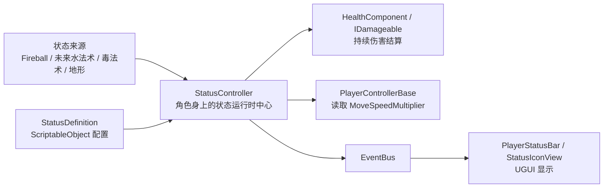

# 状态系统设计解析（2026-07-06 21:22）

## 0. 这套功能最终实现了什么

这次实现的是第一版通用状态系统。它的目标不是只做一个“燃烧 DoT”，而是给后续元素玩法打基础：

```text
角色被某种元素/法术命中
-> 获得某个状态，例如 Burning / Wet / Poisoned / Sticky
-> 状态以 0-100 的百分比强度存在
-> 强度随时间衰减
-> 状态可以产生效果：掉血、减速、显示 VFX、触发状态反应
-> 强度归零后状态消失，UI icon 隐藏，VFX 销毁
```

目前已经支持 4 个状态：

| 状态 | 作用 |
|---|---|
| `Burning` | 燃烧，持续掉血，可显示 OnFire VFX |
| `Wet` | 潮湿，本身不掉血，但会加速 `Burning` 的衰减 |
| `Poisoned` | 中毒，持续掉血 |
| `Sticky` | 粘稠，降低角色普通移动速度 |

从玩家视角看，状态系统由三部分组成：

1. 角色身上出现状态 icon 和百分比。
2. 百分比随时间下降。
3. 状态会真实影响战斗，例如持续掉血、减速、灭火。

从架构视角看，状态系统由四层组成：



---

## 1. 基础知识和原理

### 1.1 什么是状态系统

游戏里的状态系统，本质上是在角色身上挂一组“持续存在的战斗影响”。它和一次性伤害不同：

```text
一次性伤害：火球命中 -> 立刻扣 10 点血 -> 结束
状态效果：火球命中 -> 获得 Burning -> 后续几秒持续掉血 -> 状态归零消失
```

常见状态包括：

- `Burning`：持续伤害。
- `Poisoned`：持续伤害，可能不能被水熄灭。
- `Wet`：改变其他状态，例如灭火、增强雷电伤害。
- `Sticky`：减速。
- `Stunned`：眩晕，限制输入或 AI。
- `Frozen`：冻结，限制行动并改变受击反应。

这类系统一般是战斗系统的基础设施，因为后续很多技能、怪物、环境都会依赖它。

### 1.2 为什么用百分比强度，而不是简单 duration

很多游戏状态只用 `duration`：

```text
Burning duration = 3 秒
3 秒内持续掉血
3 秒后消失
```

这很简单，但不适合你想做的 Noita-like 元素玩法。因为 Noita 里的状态更像“身上沾了多少东西”：

```text
Burning = 80%
Wet = 30%
Poisoned = 50%
```

百分比模型的优势：

1. 状态可以叠加：再次被火命中，`Burning` 从 40% 变 85%。
2. 状态可以互相影响：有 `Wet` 时，`Burning` 更快下降。
3. UI 更直观：玩家能看到自己身上还剩多少状态。
4. 未来可以扩展元素反应：例如 `Wet + Lightning`、`Oil + Burning`。

所以这次没有用“固定持续时间 Buff”，而是使用：

```text
Intensity = 0-100
每帧 Intensity -= DecayPerSecond * Time.deltaTime
```

### 1.3 DoT 的基本原理

`DoT` 是 `Damage over Time`，也就是持续伤害。

它通常不应该每帧扣血。因为每帧扣血会导致：

- 数值太碎，不好调。
- UI/反馈太频繁。
- 容易造成每帧事件过多。

所以常用做法是 tick：

```text
每隔 DamageInterval 秒结算一次伤害
每次造成 BaseDamagePerTick * 当前状态强度比例 的伤害
```

例如：

```text
Burning 强度 = 50
BaseDamagePerTick = 4
本次 tick 伤害 = 4 * 50 / 100 = 2
```

这样强度越低，持续伤害也越低。它符合“火快灭了，所以烧得没那么痛”的直觉。

### 1.4 状态反应的基本原理

状态反应就是“一个状态影响另一个状态”。

当前实现了最小的一条规则：

```text
如果目标同时有 Burning 和 Wet
那么 Burning 的衰减速度额外增加
```

代码语义是：

```csharp
if (kind == StatusKind.Burning && HasStatus(StatusKind.Wet))
    decay += _wetExtinguishBurningPerSecond;
```

这就是元素系统的最小雏形。以后可以继续扩展：

```text
Wet + Lightning -> 额外伤害
Oil + Burning -> Burning 增长
Frozen + Fire -> Frozen 快速消退
Poisoned + Fire -> 毒雾爆炸
```

### 1.5 为什么状态系统属于 Combat

状态系统影响伤害、生命、移动、战斗表现，因此它属于 `Game.Combat`。

但是要注意边界：

```text
Game.Combat 可以知道 HealthComponent / DamageRequest
Game.Combat 不应该知道具体 UI 怎么画
Game.Combat 不应该知道 WizardController 怎么施法
```

所以我们把核心放在 `Game.Combat`，UI 通过 `EventBus` 监听状态变化，而不是让 `StatusController` 直接引用 UI。

---

## 2. 业界常见实现方案

### 2.1 方案一：每个状态一个 MonoBehaviour

例如：

```text
BurnStatus.cs
PoisonStatus.cs
StickyStatus.cs
WetStatus.cs
```

每个状态都是一个组件，挂到角色身上。

优点：

- 容易理解。
- 每个状态逻辑独立。
- 小项目开发快。

缺点：

- 状态越来越多时，脚本爆炸。
- 状态之间互相反应会变成组件互相找组件。
- UI 很难统一显示。
- 数据配置分散，策划调参不方便。

你项目里原来的 `BurnStatus` 就是这种模式。它对“只有火球燃烧”很好用，但不适合扩展成元素系统。

### 2.2 方案二：统一 Buff 列表

很多 RPG 会做：

```text
BuffController
  List<BuffInstance>
```

每个 `BuffInstance` 记录：

```text
BuffId
RemainingTime
StackCount
Source
```

优点：

- 通用。
- 可以支持大量 Buff。
- 很适合传统 RPG、MMO、ARPG。

缺点：

- 如果直接做成传统 Buff，容易变成“图标 + 持续时间”系统。
- 不一定适合 Noita-like 的“元素残留百分比”。

### 2.3 方案三：状态百分比模型

这是这次选择的方案。

核心不是 `duration`，而是：

```text
StatusKind -> Intensity 0-100
```

例如：

```text
Burning: 45
Wet: 80
Sticky: 30
```

优点：

- 更接近 Noita 的状态体验。
- 容易做元素反应。
- UI 表达清楚。
- 未来能和环境元素、体素、区域场结合。

缺点：

- 需要额外处理衰减、叠加、状态反应。
- 比普通 duration Buff 更复杂。
- 每个状态的含义需要设计清楚，否则玩家会困惑。

### 2.4 方案四：Ability System / Gameplay Effect 风格

大型项目可能会做类似 Unreal `Gameplay Ability System` 的系统：

```text
GameplayEffect
Attribute
Modifier
Tag
StackPolicy
DurationPolicy
Cue
```

优点：

- 极强扩展性。
- 很适合大型团队。
- 可以支持复杂数值、标签、免疫、驱散、叠层。

缺点：

- 对当前项目过重。
- 学习成本高。
- 代码量大，容易让你作为初学者只学到框架，不理解战斗本质。

所以当前阶段不采用这种重型系统，而是先做一个你能理解、能扩展、能服务 Noita-like 目标的轻量版本。

---

## 3. 最终选择的方案与技术

### 3.1 核心选择

最终采用：

```text
StatusDefinition：状态配置
StatusController：角色身上的状态运行时
StatusInstance：单个状态的运行时数据
StatusChangedEvent：通知 UI
PlayerStatusBar：玩家状态 UI
```

这是一种“数据驱动 + 运行时控制器 + 事件 UI”的结构。

### 3.2 Unity 技术点

#### `ScriptableObject`

`StatusDefinition` 是 `ScriptableObject`。

作用：

- 保存状态的静态数据。
- 让你在 Unity Inspector 里调参。
- 避免把 Burning/Poisoned 的数值写死在代码里。

例如：

```text
Status_Burning.asset
NaturalDecayPerSecond = 6
DealsDamage = true
DamageInterval = 0.3
BaseDamagePerTick = 1
VfxPrefab = OnFire
```

`ScriptableObject` 的好处是：同一个状态定义可以被很多角色共享。

#### `[CreateAssetMenu]`

`StatusDefinition` 和 `StatusDatabase` 使用了：

```csharp
[CreateAssetMenu(menuName = "Game/Combat/Status Definition", fileName = "StatusDefinition")]
```

这让你可以在 Unity 右键菜单里创建资产：

```text
Create -> Game -> Combat -> Status Definition
```

#### `[SerializeField]`

`StatusController` 里：

```csharp
[SerializeField] private StatusDatabase _database;
```

意思是字段保持 `private`，但仍然能在 Inspector 里拖引用。

这是 Unity 项目里很常见的封装方式：

```text
外部代码不能乱改字段
Editor 可以配置字段
```

#### `MonoBehaviour.Update`

`StatusController.Update()` 每帧调用：

```csharp
Tick(Time.deltaTime);
```

它负责让状态随真实时间推进。

#### `Time.deltaTime`

`Time.deltaTime` 表示上一帧到这一帧经过了多少秒。

状态衰减用它是必要的：

```csharp
instance.Intensity -= decay * deltaTime;
```

否则不同帧率下，状态下降速度会不同。

#### `Mathf.Clamp`

用于把状态强度限制在 `0-100`：

```csharp
Mathf.Clamp(instance.Intensity + amount, 0f, 100f)
```

这样重复施加 Burning 不会超过 100%。

#### `Mathf.Max`

用于防止强度变成负数：

```csharp
Mathf.Max(0f, instance.Intensity - decay * deltaTime)
```

也用于防止 DoT 间隔为 0：

```csharp
Mathf.Max(0.05f, definition.DamageInterval)
```

#### `Mathf.RoundToInt`

状态 UI 不需要每帧显示 44.3721%，所以用：

```csharp
Mathf.RoundToInt(instance.Intensity)
```

把它显示成整数百分比。

同时这也减少了 UI 刷新频率：只有整数百分比变化时才发布 UI 事件。

#### `Instantiate` 和 `Destroy`

状态 VFX 用：

```csharp
Instantiate(definition.VfxPrefab, transform.position, transform.rotation, transform);
Destroy(_vfxInstances[index]);
```

`Instantiate` 创建状态特效，例如 OnFire。

最后一个参数 `transform` 表示把 VFX 挂到角色身上，角色移动时特效跟随角色。

`Destroy` 用于状态归零后销毁 VFX。

#### `GetComponent` / `GetComponentInParent`

`StatusController` 在 `Awake` 里拿同物体上的 `IDamageable`：

```csharp
_damageable = GetComponent<IDamageable>();
```

火球命中某个 collider 后，用：

```csharp
hitCollider.GetComponentInParent<StatusController>();
```

原因是命中的 collider 可能是角色子物体，真正的 `StatusController` 挂在根物体上。

#### `EventBus<T>`

UI 不直接被 Combat 调用，而是监听事件：

```csharp
EventBus<StatusChangedEvent>.Publish(...)
```

这样 `Game.Combat` 不依赖 `Game.UI`。

这符合项目架构规则：

```text
Gameplay 不直接引用 Presentation
Presentation 通过 EventBus 被动响应
```

#### UGUI `Image` 和 `Text`

`StatusIconView` 使用：

```csharp
Image _icon
Text _percentageText
```

`Image` 显示状态 icon。

`Text` 显示百分比。

---

## 4. 架构设计与拆解

### 4.1 总体架构

状态系统位于 Combat 层，但被多个系统消费：

```text
Game.Combat
  StatusDefinition
  StatusDatabase
  StatusController
  StatusChangedEvent

Game.Character
  PlayerControllerBase 读取 StatusController.MoveSpeedMultiplier

Game.UI
  PlayerStatusBar 监听 StatusChangedEvent
  StatusIconView 显示 icon + 百分比
```

重点是依赖方向：

```text
Character -> Combat
UI -> Combat
Combat -> Core
Combat 不依赖 Character
Combat 不依赖 UI
```

### 4.2 数据层：StatusDefinition

文件：

```text
Assets/_Project/Scripts/Combat/Status/StatusDefinition.cs
```

它描述“某个状态是什么”。

关键字段：

```csharp
public StatusKind Kind;
public string DisplayName;
public Sprite Icon;
public float NaturalDecayPerSecond;
public GameObject VfxPrefab;
```

这些是通用显示和生命周期字段。

DoT 字段：

```csharp
public bool DealsDamage;
public float DamageInterval;
public float BaseDamagePerTick;
public DamageType DamageType;
public bool TriggerHitReaction;
```

移动修正字段：

```csharp
public bool AffectsMoveSpeed;
public float MaxMoveSpeedSlowRatio;
```

这里的设计重点是：状态的“数值表现”放到资产里，而不是写死到 `StatusController`。

### 4.3 查询层：StatusDatabase

文件：

```text
Assets/_Project/Scripts/Combat/Status/StatusDatabase.cs
```

它保存一组 `StatusDefinition`，并提供：

```csharp
TryGet(StatusKind kind, out StatusDefinition definition)
```

为什么需要 Database？

因为 `StatusController` 只知道“我要处理 Burning”，但它需要找到 Burning 对应的配置资产。

如果没有 Database，就可能要在每个角色的 `StatusController` 上分别拖 4 个字段：

```text
BurningDefinition
WetDefinition
PoisonedDefinition
StickyDefinition
```

这会让 Inspector 很乱。Database 把这件事集中起来。

### 4.4 运行时层：StatusInstance

文件：

```text
Assets/_Project/Scripts/Combat/Status/StatusInstance.cs
```

它保存“某个角色身上当前状态的运行时数据”。

字段：

```csharp
public bool Active;
public float Intensity;
public float TickTimer;
public int SourceId;
public byte SourceTeam;
```

这里要区分：

```text
StatusDefinition = 静态配置
StatusInstance = 运行时状态
```

例如：

```text
Status_Burning.asset:
  DamageInterval = 0.3
  BaseDamagePerTick = 1

某个敌人的 StatusInstance:
  Active = true
  Intensity = 45
  TickTimer = 0.18
  SourceId = 玩家 id
  SourceTeam = 玩家阵营
```

`SourceId` 和 `SourceTeam` 很重要，因为 DoT 伤害也要知道是谁造成的。

否则中毒/燃烧杀死敌人时，击杀归属会丢失。

### 4.5 核心运行时：StatusController

文件：

```text
Assets/_Project/Scripts/Combat/Status/StatusController.cs
```

这是状态系统的核心。

它挂在角色根物体上，和 `HealthComponent` 放在同一个对象上。

主要职责：

1. 接收状态施加。
2. 叠加强度并 clamp 到 100。
3. 每帧衰减状态。
4. 执行状态反应。
5. 执行 DoT tick。
6. 创建和销毁状态 VFX。
7. 计算移动速度倍率。
8. 发布 `StatusChangedEvent` 给 UI。

#### 状态施加流程

```csharp
public void ApplyStatus(StatusKind kind, float amount, int sourceId, byte sourceTeam)
```

含义：

```text
kind：施加哪种状态
amount：增加多少百分比强度
sourceId：来源是谁
sourceTeam：来源阵营
```

火球调用：

```csharp
status.ApplyStatus(StatusKind.Burning, _burningApplyAmount, _attackerId, _attackerTeam);
```

#### 状态 Tick 流程

每帧：

```text
遍历所有状态
-> 如果 Active
-> 读取 definition
-> 计算衰减
-> 如果 Burning + Wet，加速 Burning 衰减
-> 如果 DealsDamage，按 DamageInterval tick 掉血
-> 如果 Intensity <= 0，关闭状态并销毁 VFX
-> 如果显示百分比变化，发布事件
```

#### 为什么用数组，而不是 Dictionary

当前状态数量固定且很少：

```text
Burning = 0
Wet = 1
Poisoned = 2
Sticky = 3
```

所以可以用数组：

```csharp
private readonly StatusInstance[] _instances = new StatusInstance[StatusCount];
```

好处：

- 无哈希开销。
- 不需要运行时分配。
- 访问快。
- 符合项目 hot path 不分配的规则。

代价：

- 新增状态时要更新 `StatusKind` 和 `StatusCount`。

当前项目阶段，这个代价可以接受。

### 4.6 火球接入：Fireball

文件：

```text
Assets/_Project/Scripts/Combat/Projectiles/Fireball.cs
```

原来的模式是：

```text
Fireball 命中
-> 给目标 AddComponent<BurnStatus>
-> BurnStatus 自己计时、扣血、生成 OnFire
```

现在改成：

```text
Fireball 命中
-> 找目标身上的 StatusController
-> ApplyStatus(Burning, 45)
-> StatusController 统一处理燃烧
```

这次迁移的意义：

```text
Fireball 不再拥有燃烧规则
Fireball 只表达：我会施加 Burning
Burning 具体怎么掉血、怎么显示、怎么衰减，由 StatusDefinition 决定
```

这样以后毒球、水球、粘液球都可以走相同模式。

### 4.7 移动接入：PlayerControllerBase

文件：

```text
Assets/_Project/Scripts/Character/Controllers/PlayerControllerBase.cs
```

新增：

```csharp
private StatusController _statusController;
public float StatusMoveSpeedMultiplier => _statusController != null ? _statusController.MoveSpeedMultiplier : 1f;
```

普通移动状态里改成：

```csharp
_player.MoveDirection * _player.MoveSpeed * _player.StatusMoveSpeedMultiplier
```

影响的状态：

```text
PlayerGroundedState
PlayerAirborneState
PlayerBowAttackState
PlayerWizardAttackState
```

为什么不影响 Dash？

因为第一版设计里，`Sticky` 主要降低普通走位能力。Dash 是短时间技能位移，如果也一起减速，手感可能太硬。以后如果需要，可以单独做：

```text
StatusDashSpeedMultiplier
```

不要直接混到普通移动倍率里。

### 4.8 UI 接入：PlayerStatusBar 和 StatusIconView

文件：

```text
Assets/_Project/Scripts/UI/PlayerStatusBar.cs
Assets/_Project/Scripts/UI/StatusIconView.cs
```

`PlayerStatusBar` 监听：

```csharp
EventBus<StatusChangedEvent>.Subscribe(OnStatusChanged);
```

收到事件后：

```text
检查 TargetId 是否是当前玩家
-> 根据 StatusKind 找到对应 Slot
-> 如果 IsActive，显示 icon + 百分比
-> 如果 inactive，隐藏 slot
```

`StatusIconView` 只负责一个 slot 的显示：

```text
Set(icon, intensity)
Clear()
```

为什么 UI 不直接每帧查 `StatusController`？

因为那样 UI 需要知道玩家对象、状态控制器、查询时机。使用事件后：

```text
状态变化时才通知 UI
UI 被动刷新
```

架构更干净。

---

## 5. 添加和改动的脚本清单

### 新增脚本

| 文件 | 作用 |
|---|---|
| `Assets/_Project/Scripts/Combat/Status/StatusKind.cs` | 定义状态枚举：`Burning / Wet / Poisoned / Sticky` |
| `Assets/_Project/Scripts/Combat/Status/StatusDefinition.cs` | 单个状态的 `ScriptableObject` 配置 |
| `Assets/_Project/Scripts/Combat/Status/StatusDatabase.cs` | 状态配置表，根据 `StatusKind` 查找定义 |
| `Assets/_Project/Scripts/Combat/Status/StatusInstance.cs` | 运行时状态数据 |
| `Assets/_Project/Scripts/Combat/Status/StatusController.cs` | 状态系统运行时核心 |
| `Assets/_Project/Scripts/Combat/Events/StatusChangedEvent.cs` | 状态变化事件，给 UI 使用 |
| `Assets/_Project/Scripts/UI/StatusIconView.cs` | 单个状态 icon + 百分比显示 |
| `Assets/_Project/Scripts/UI/PlayerStatusBar.cs` | 玩家状态栏，监听状态事件 |
| `Assets/_Project/Tests/Combat/StatusControllerTests.cs` | 状态系统 EditMode 测试 |

### 修改脚本

| 文件 | 改动 |
|---|---|
| `Assets/_Project/Scripts/Combat/Projectiles/Fireball.cs` | 火球从 `BurnStatus` 迁移到 `StatusController.ApplyStatus(Burning)` |
| `Assets/_Project/Scripts/Combat/Status/BurnStatus.cs` | 标记为 obsolete legacy，不再作为主路径 |
| `Assets/_Project/Scripts/Character/Controllers/PlayerControllerBase.cs` | 缓存 `StatusController`，暴露 `StatusMoveSpeedMultiplier` |
| `Assets/_Project/Scripts/Character/States/PlayerGroundedState.cs` | 普通地面移动接入状态减速 |
| `Assets/_Project/Scripts/Character/States/PlayerAirborneState.cs` | 空中移动接入状态减速 |
| `Assets/_Project/Scripts/Character/States/PlayerBowAttackState.cs` | 弓箭边射边走接入状态减速 |
| `Assets/_Project/Scripts/Character/States/PlayerWizardAttackState.cs` | 法师边施法边走接入状态减速 |

### 修改资产

| 资产 | 改动 |
|---|---|
| `Status_Burning.asset` | `DealsDamage = true` |
| `Status_Wet.asset` | `Kind = Wet` |
| `Status_Poisoned.asset` | `Kind = Poisoned`，`DealsDamage = true` |
| `Status_Sticky.asset` | `Kind = Sticky` |

---

## 6. 踩坑与 Debug

### 6.1 问题：燃烧有状态和 VFX，但不持续掉血

现象：

```text
火球命中角色
Burning icon 正常显示
OnFire VFX 正常显示
百分比正常下降
但是血量没有持续减少
```

### 6.2 排查链路

燃烧 DoT 的运行链路是：

```text
Fireball.OnImpact
-> ApplyBurn
-> StatusController.ApplyStatus(Burning)
-> StatusController.Tick
-> definition.DealsDamage == true ?
-> DamageRequest
-> IDamageable.ReceiveHit
-> HealthComponent 扣血
```

前面几步都正常：

- 状态能显示，说明 `ApplyStatus` 调到了。
- VFX 能显示，说明 `StatusDefinition` 能被查到。
- 百分比能下降，说明 `Tick` 正常运行。

所以问题很可能在 DoT 条件：

```csharp
if (definition != null && definition.DealsDamage && _damageable != null && _damageable.IsAlive)
```

其中最可疑的是：

```text
definition.DealsDamage
```

### 6.3 根因

读取 `Status_Burning.asset` 后看到：

```yaml
DealsDamage: 0
```

也就是 Inspector 里 `Deals Damage` 没勾选。

所以代码按照设计正确跳过了 DoT 分支：

```text
DealsDamage = false
-> 不扣血
```

这不是代码逻辑错误，而是 `ScriptableObject` 配置错误。

### 6.4 同时发现的配置问题

扫描状态资产时，还发现：

```text
Status_Wet.Kind = 0
Status_Poisoned.Kind = 0
Status_Sticky.Kind = 0
```

而 `StatusKind` 的枚举是：

```text
Burning = 0
Wet = 1
Poisoned = 2
Sticky = 3
```

也就是说，这几个资产虽然文件名是 Wet/Poisoned/Sticky，但内部 `Kind` 还都是 Burning。

这会导致 `StatusDatabase.TryGet(StatusKind.Wet)` 找不到真正的 Wet 配置，或者查询结果混乱。

### 6.5 修复

已修正：

```text
Status_Burning.DealsDamage = true
Status_Wet.Kind = Wet
Status_Poisoned.Kind = Poisoned
Status_Poisoned.DealsDamage = true
Status_Sticky.Kind = Sticky
```

### 6.6 这个坑说明了什么

这个问题很典型：数据驱动系统的 bug 不一定在代码里，也可能在资产配置里。

以后排查这类问题，要按运行链路看：

```text
代码有没有调用？
Controller 有没有收到？
Definition 有没有查到？
Definition 字段是不是正确？
条件分支有没有被配置挡住？
最终 DamageRequest 有没有发出？
```

对 Unity 项目来说，`ScriptableObject` 是代码的一部分。因为它直接决定运行时逻辑。

---

## 7. 测试与验证

### 7.1 EditMode 测试覆盖

`StatusControllerTests` 覆盖了：

1. 状态强度叠加并 clamp 到 100。
2. 状态随时间自然衰减。
3. 状态强度归零后 inactive。
4. `Wet` 加速 `Burning` 衰减。
5. `Sticky` 生成移动速度倍率。
6. `Poisoned` 能造成 DoT。

这些测试主要验证纯逻辑，不依赖 Play Mode。

### 7.2 命令行构建验证

已运行：

```powershell
dotnet build Game.Combat.Tests.csproj --no-restore /m:1
dotnet build Game.Combat.csproj --no-restore /m:1
dotnet build Game.Character.csproj --no-restore /m:1
dotnet build Game.UI.csproj --no-restore /m:1
```

结果：

```text
0 warning
0 error
```

### 7.3 Play Mode 仍需验证

命令行构建只能证明 C# 编译通过，不能证明 Unity 场景绑定正确。

Play Mode 需要你重点验证：

```text
火球命中敌人
-> 敌人出现 Burning icon / VFX
-> 敌人每 0.3 秒持续掉血
-> Burning 归零后停止掉血，VFX 消失
```

---

## 8. 模拟大厂面试 Q&A

### Q1：为什么不用原来的 BurnStatus，而要做通用 StatusController？

答：`BurnStatus` 适合单一燃烧效果，但不适合扩展成元素系统。随着状态增多，如果每个状态都是一个 MonoBehaviour，状态之间反应会变成组件互相查找，UI 也很难统一。`StatusController` 把状态运行时集中管理，`StatusDefinition` 把数据配置抽离出来。这样新增状态时，优先增加数据，而不是复制一套组件逻辑。

### Q2：为什么状态用百分比强度，而不是 duration？

答：因为项目目标接近 Noita-like 元素玩法。百分比强度能表达“身上沾了多少火、水、毒、粘液”，比 duration 更适合元素反应。例如 `Wet` 可以加快 `Burning` 下降，火球再次命中可以增加 `Burning` 强度。duration 更适合传统 Buff，但表达元素残留不够自然。

### Q3：状态 DoT 为什么不每帧扣血？

答：每帧扣血会导致数值过碎、反馈过频繁，也会增加事件和 UI 更新压力。更常见的做法是 tick，例如每 0.3 秒结算一次。这样既容易调参，也能减少运行时压力。

### Q4：为什么 StatusDefinition 用 ScriptableObject？

答：状态是数据驱动内容。`ScriptableObject` 可以让设计者在 Inspector 中配置衰减速度、DoT 间隔、每 tick 伤害、icon、VFX 等，不需要改代码。多个角色共享同一份状态定义，运行时每个角色只保存自己的 `StatusInstance`。

### Q5：为什么 UI 通过 EventBus，而不是 StatusController 直接引用 UI？

答：这是为了保持模块边界。`Game.Combat` 是玩法层，不应该依赖 `Game.UI`。状态变化通过 `StatusChangedEvent` 发布，UI 订阅事件后更新显示。这样 Combat 可以独立测试，UI 可以替换实现，二者不会互相耦合。

### Q6：为什么用数组存状态，而不是 Dictionary？

答：当前状态数量很少，并且 `StatusKind` 是连续 enum。数组可以用 enum 转 index 直接访问，不需要哈希查找，也避免运行时分配。缺点是新增状态时要维护 `StatusCount`，但当前阶段这是可接受的。

### Q7：如果以后状态数量很多，这套设计怎么扩展？

答：可以把 `StatusCount` 改成从 enum 或 database 初始化，或者改成预分配数组 + `StatusKind` 映射表。如果状态需要复杂行为，可以引入策略对象，例如 `StatusEffectHandler` 或 `IStatusRule`，但当前不需要过早抽象。

### Q8：这次燃烧不掉血的根因是什么？

答：根因是资产配置错误。`Status_Burning.asset` 的 `DealsDamage` 没有勾选，导致 `StatusController.Tick` 中的 DoT 条件失败，所以状态显示和 VFX 正常，但不会生成 `DamageRequest`。同时还发现 Wet/Poisoned/Sticky 的 `Kind` 配置仍是默认 Burning，已一起修正。

### Q9：为什么 Sticky 只影响普通移动，不影响 Dash？

答：这是第一版手感边界。普通移动受粘稠影响符合直觉，但 Dash 是短时间逃生/机动能力，如果一起降低，可能让控制变得过于迟钝。未来如果设计需要，可以单独引入 `DashSpeedMultiplier`，而不是把所有移动都混在一个倍率里。

### Q10：状态系统如何和未来的沙盒元素世界结合？

答：未来环境元素可以成为状态来源。例如水区域每秒给角色施加 `Wet`，毒雾区域施加 `Poisoned`，油区域施加 `Oiled`。它们不需要直接改角色逻辑，只要调用 `StatusController.ApplyStatus`。状态系统就成为角色和环境元素之间的统一接口。

---

## 9. 模拟面试者完整讲解

这次我实现的是一套通用状态系统，目标是为后续 Noita-like 元素玩法打基础，而不是只做一个燃烧 DoT。最开始项目里已经有火球命中后附加 `BurnStatus` 的能力，但它是单独的 MonoBehaviour，只服务燃烧一个效果。如果后续继续用这种方式做潮湿、中毒、粘稠、眩晕，每个状态都会变成一个独立组件，状态之间的反应和 UI 显示会越来越难维护。

所以我把状态系统拆成了数据层、运行时层和表现层。数据层是 `StatusDefinition`，它是一个 `ScriptableObject`，用于配置状态类型、显示名、icon、自然衰减速度、VFX、DoT 参数和移动修正参数。运行时层是 `StatusController`，挂在角色根物体上，负责保存每种状态当前的 `Intensity`、tick 计时器、来源攻击者和来源阵营。表现层则通过 `StatusChangedEvent` 通知 UI，`PlayerStatusBar` 收到事件后刷新对应状态 icon 和百分比。

状态模型上，我没有用传统的 duration，而是用 0-100 的百分比强度。这样更符合 Noita-like 的元素残留体验。例如火球命中不是简单给 3 秒 Burning，而是给目标增加 45 点 Burning 强度。强度每帧根据 `NaturalDecayPerSecond * Time.deltaTime` 下降，重复命中会继续叠加但 clamp 到 100。这样后续做水、油、毒、冰等元素时，可以围绕百分比做反应。

在战斗结算上，我让 DoT 继续走项目已有的 `IDamageable.ReceiveHit(in DamageRequest)` 漏斗。`StatusController` 在 tick 到达时，根据当前强度计算伤害，然后构造 `DamageRequest`，交给 `HealthComponent` 统一扣血。这样 DoT 和火球直击、近战、范围伤害都走同一套伤害系统，不会产生第二套扣血逻辑。

在模块边界上，状态核心放在 `Game.Combat`，UI 放在 `Game.UI`。Combat 不直接引用 UI，而是发布 `StatusChangedEvent`。角色移动属于 `Game.Character`，它只读取 `StatusController.MoveSpeedMultiplier`，用于让 `Sticky` 降低普通移动速度。这个设计保持了依赖方向清晰：Combat 提供状态能力，Character 和 UI 消费状态结果，但 Combat 不反向依赖它们。

最后这次调试也暴露了数据驱动系统的一个典型问题：燃烧状态显示正常、VFX 正常，但没有持续掉血。沿着运行链路排查后，发现代码的 DoT 分支需要 `StatusDefinition.DealsDamage == true`，而 `Status_Burning.asset` 里这个字段没有勾选，所以代码按设计跳过了 DoT。修复方式不是改代码，而是修正资产配置。同时还发现 Wet、Poisoned、Sticky 的 `Kind` 都还是默认的 Burning，也一并修正。这个问题说明，在 Unity 的数据驱动架构里，`ScriptableObject` 配置本身就是运行时逻辑的一部分，Debug 时必须把代码和资产一起看。
